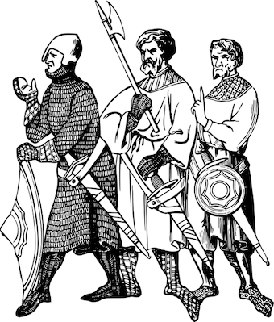

# Border Patrol

__This Project is WIP__

Border Patrol is an Architecture Linter. That means that it helps you to avoid
introducing code that goes against the project's structure. It prevents you from
importing/using packages you shouldn't. `MyProject.Format.Json` should not be
importing anything from `Graphics.*`, so don't allow it - __enforce__ it.

Border Patrol is best using when applying the architectural thinking described in
[The Hexagonal Architecture](http://alistair.cockburn.us/Hexagonal+architecture)
and [Domain-driven design](https://en.wikipedia.org/wiki/Domain-driven_design).

## Configuration File

Place a _JSON_ file called `boundaries.json` at the root of project.

### Example

```json
{
  "restrictions": {
    "Api": ["Html"],
    "Logic": ["Http", "Api", "SQL"],
    "GUI": ["Api", "Http"]
  }
}
```

The `Api.*` modules should not be producing any view HTML so has no business
importing the `Html.*` packages.

The `Logic.*` modules should be where the bulk of the business logic lives, it
should not touch networking code or database dependencies.

## Running

```bash
$ border-patrol
```

If all rules pass it returns with exit code `0`, if any violations are found it
exits with exit code `1`. This makes it easy to make Border Patrol part of your
CI setup.

## Supported Languages

This is a very young project. These are the languages we initial plan to support.

- [ ] Java
- [ ] Scala
- [x] Elm
- [ ] NodeJS
- [ ] Go

but suggestions and contributions/PRs are welcome!

## Rational

_Code Cohesion_ is a measure of how closely code elements inside a
module are related to each other. As a project grows and new contributors join
cohesion tends to creep.

Grouping code in packages you can quite easily see what the code should and should
_not_ be doing, e.g. code inside the `API` package should probably be dealing
with packages like `network`, `http` or `json` but probably not be using `html` or
`opengl`.

So, `API` should not even be allowed to import those packages. That is common sense.
In teams conventions like these are hard to maintain without formalizing them as code -
this is what Border Patrol was made for. It maintains the boundaries between code with
different responsibilities in your code base.

## Project Sponsor - Humio


[Humio](https://humio.com/)

Humio is a Distributed Log Aggregation and Monitoring System. Humio has a
powerful query language and makes it feel like using `tail` and `grep` with
aggregation functions and graphs built-in. It crunches through TB of data in no
time at all.
